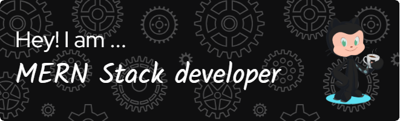

<h1 align="center" style="color: white; margin-bottom: 20px;">Hi 👋, I'm Arjun Singh</h1>

  

<h3 align="center" style="color: white; margin-bottom: 20px;">A passionate MERN stack developer from India</h3>

  

<ul style="color: white; margin-bottom: 20px;">
  <li>🔭 I’m currently working on TechiesShubhdeep IT Solutions <a href="https://github.com/Arjun-1431/Real-estate.git" style="color: #0e75b6;">Real-estate</a></li>
  <li>🌱 I’m currently learning <strong>React.js, Express.js, Node.js, MongoDB</strong></li>
  <li>👨‍💻 All of my projects are available at <a href="https://github.com/Arjun-1431" style="color: #0e75b6;">https://github.com/Arjun-1431</a></li>
  <li>💬 Ask me about <strong>React.js, Node.js, Express.js, MongoDB</strong></li>
  <li>📫 How to reach me <strong>arjunsingh32085@gmail.com</strong></li>
  <li>📄 Know about my experiences <a href="https://drive.google.com/file/d/1AwUiErqZdnKHZ1nThtA-Vp3kpY-5lFdi/view?usp=sharing" style="color: #0e75b6;">here</a></li>
</ul>

<h3 align="left" style="color: white; margin-bottom: 20px;">Connect with me:</h3>

  
  

<h3 align="left" style="color: white; margin-bottom: 20px;">Languages and Tools:</h3>

  
  
  
  
  
  
  
  
  
  
  
  
  
  

<h3 align="left" style="color: white; margin-bottom: 20px;">Support:</h3>

  

    

  

  &nbsp;

  

